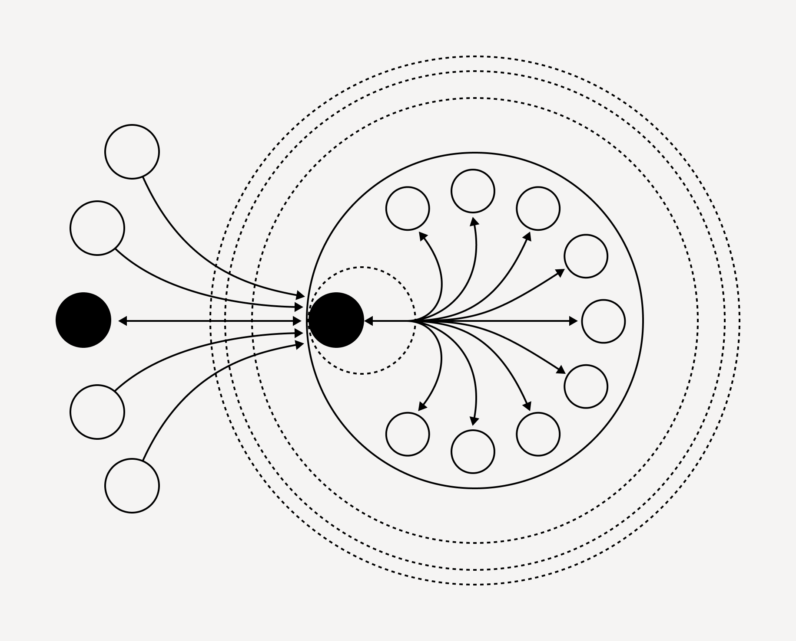

# Orchestra

Orchestra is a lightweight and intuitive open-source framework for creating AI-driven task pipelines and multi-agent teams, centered around the concept of Tasks rather than conversation patterns.

### Core Principles

Orchestra is built around the concept of task completion, rather than conversation patterns. It has a modular architecture with interchangeable components. It's meant to be lightweight with minimal dependencies, and it offers transparency through a flat hierarchy and full prompt exposure.



### Core Components

##### Tasks

Tasks are the fundamental building blocks of Orchestra. Each task represents a single, discrete unit of work to be performed by a Large Language Model. They include an optional context field for providing relevant background information, and an instruction that defines the core purpose of the task.

##### Agents

An Agent in Orchestra represents a specific role or persona with a clear goal. It can have optional attributes, and is powered by a selected language model (LLM). This structure allows Agents to maintain a consistent persona across multiple tasks. Agents can also be assigned tools, which are specific deterministic functions that the agent can use to interact with libraries, APIs, the internet, and more. 

##### Tools

Tools in Orchestra are wrappers around external services or APIs, as well as utilities for common operations. You can link tools together with tasks to create structured, deterministic AI-integrated pipelines, offering precise control over the AI's actions in scenarios that require predictable workflows. Or, you can directly assign tools to agents, and the agents to tasks, enabling more autonomous, self-determined tool use. In this mode, AI Agents can independently choose and utilize tools to complete their assigned tasks.

##### Language Models

Orchestra supports various Language Models out-of-the-box, including models from OpenAI, Anthropic, open source models from OpenRouter, Groq, and Ollama where they can be locally hosted on device. 

### Getting Started

To begin using Orchestra:

- Create a folder for your Orchestra projects
- Create a .env file with your relevant API Keys
- In your new folder, set up a virtual environment and install Orchestra

```bash
python -m venv venv
source venv/bin/activate  # On Windows use: venv\Scripts\activate
pip install mainframe-orchestra
```

Once you have installed Orchestra, you can start building your task flows.

<Tabs items={['Single Task', 'Multi-Agent Team']}>
  <Tabs.Tab>
    ```python
    from Orchestra import Task, Agent, WebTools, OpenRouterModels

    researcher = Agent(
        role="research assistant",
        goal="answer user queries",
        attributes="thorough in web research",
        tools={WebTools.serper_search},
        llm=OpenRouterModels.haiku
    )

    def research_task(agent, topic):
        return Task.create(
            agent=agent,
            instruction=f"Research {topic} and provide a summary of the top 3 results."
        )

    def main():
        topic = input("Enter a topic to research: ")
        response = research_task(researcher, topic)
        print(response)

    if __name__ == "__main__":
        main()
    ```
  </Tabs.Tab>
  <Tabs.Tab>
    ```python
    from Orchestra import Agent, Task, WebTools, WikipediaTools, AmadeusTools, OpenrouterModels, set_verbosity
    from datetime import datetime

    set_verbosity(1)

    web_research_agent = Agent(
        role="web research agent",
        goal="search the web thoroughly for travel information",
        attributes="hardworking, diligent, thorough, comprehensive.",
        llm=OpenrouterModels.haiku,
        tools=[WebTools.serper_search, WikipediaTools.search_articles, WikipediaTools.search_images]
    )

    travel_agent = Agent(
        role="travel agent",
        goal="assist the traveller with their request",
        attributes="friendly, hardworking, and comprehensive in reporting back to users",
        llm=OpenrouterModels.haiku,
        tools=[AmadeusTools.search_flights, WebTools.serper_search, WebTools.get_weather_data]
    )

    def research_destination(destination, interests):
        return Task.create(
            agent=web_research_agent,
            context=f"User Destination: {destination}\nUser Interests: {interests}",
            instruction=f"Research {destination} and write a comprehensive report with images embedded in markdown."
        )

    def research_events(destination, dates, interests):
        return Task.create(
            agent=web_research_agent,
            context=f"Destination: {destination}\nDates: {dates}\nInterests: {interests}",
            instruction="Research events in the given location for the given date span."
        )

    def research_weather(destination, dates):
        return Task.create(
            agent=travel_agent,
            context=f"Location: {destination}\nDates: {dates}",
            instruction="Search for weather information and write a report."
        )

    def search_flights(current_location, destination, dates):
        return Task.create(
            agent=travel_agent,
            context=f"From: {current_location}\nTo: {destination}\nDates: {dates}",
            instruction="Search for flights and report on the best options."
        )

    def write_travel_report(destination_report, events_report, weather_report, flight_report):
        return Task.create(
            agent=travel_agent,
            context=f"Reports: {destination_report}, {events_report}, {weather_report}, {flight_report}",
            instruction="Write a comprehensive travel plan based on the provided reports."
        )

    def main():
        destination = input("Enter a destination: ")
        interests = input("Enter your interests: ")
        dates = input("Enter your dates of travel: ")
        current_location = input("Enter your current location: ")

        destination_report = research_destination(destination, interests)
        events_report = research_events(destination, dates, interests)
        weather_report = research_weather(destination, dates)
        flight_report = search_flights(current_location, destination, dates)
        travel_report = write_travel_report(destination_report, events_report, weather_report, flight_report)
        print(travel_report)

    if __name__ == "__main__":
        main()
    ```
  </Tabs.Tab>
</Tabs>

### Multi-Agent Teams

Orchestra enables the creation of powerful multi-agent teams by assigning tasks to agents equipped with specific tools. This approach facilitates complex workflows and collaborative problem-solving, allowing you to tackle intricate challenges that require diverse skills and knowledge.

In a multi-agent team, each agent is designed with a specialized role, a set of tools, and specific expertise. By combining these agents, you can create AI workflows capable of handling a wide range of tasks, from research and analysis to problem-solving and code generation.

